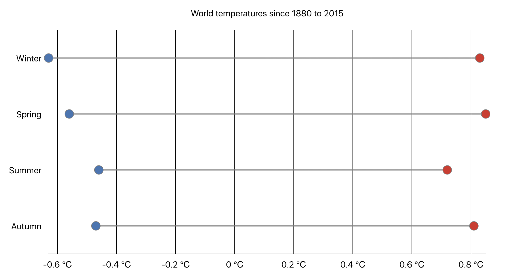
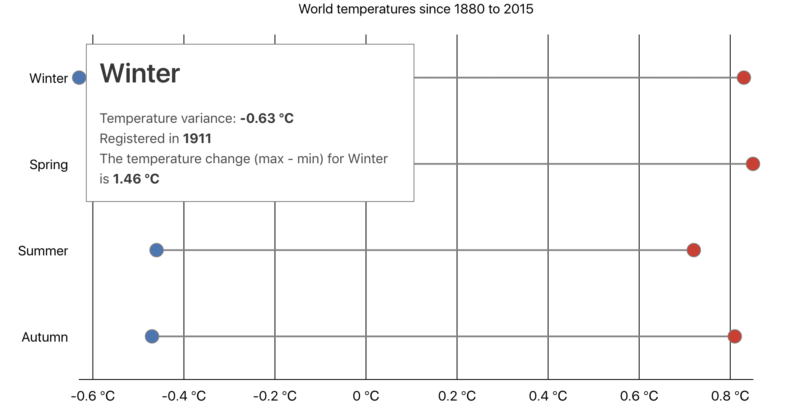

# Week 2 assignment

This project was bootstrapped with [Create React App](https://github.com/facebookincubator/create-react-app), [bulma](https://bulma.io/) and the [Semiotic](https://emeeks.github.io/semiotic/#/semiotic/) data visualization framework.

This more an experiment on using the [Semiotic](https://emeeks.github.io/semiotic/#/semiotic/) framework to visualize some data in place of simple d3 functions.

## Setup

### Requirements

* NodeJS v.6 - npm

### Istructions

To start the project install the dependencies and all the start task:

```sh
$ yarn && yarn start
```

If the browser doesn't open automatically, point your browser to `localhost:3000`.

### The assignment

The data provided for the assignment is the [GISTEMP](https://data.giss.nasa.gov/gistemp/) from NASA, in particular the **Global-mean monthly, seasonal, and annual means** dataset. The dataset can be found in the `src/data` folder.

### DataViz

The question targetted to build the visualization is: 

> what was the temperature change extent for the given period in the dataset?



Hovering each range will show a tooltip explaining more in details the data:



### Issues

Found any issue or want to improve the chart? Create an issue in the repository or submit a Pull Request!

### License

This repository is [MIT licensed](LICENSE.md)
